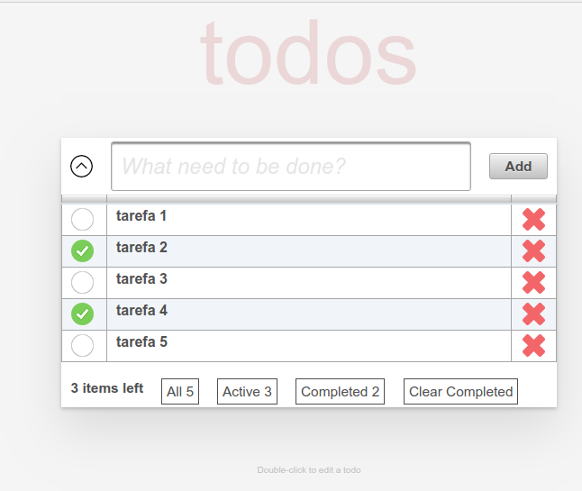
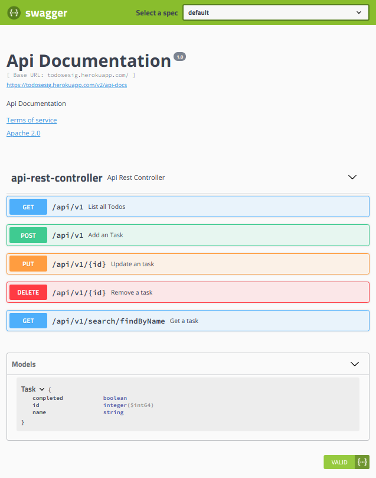

#  ToDo List - Desafio ESIG 

Os itens **A, B, C, D, E, F, G, I ** foram implementados

Foi o projeto foi implementado usando **JSF**, **Spring Framework Boot 2.0**, **PrimeFaces**, **BootStrap 4 **, **Spring Data JPA** e **Spring Data REST** e Banco de dados **MySql**.

O app foi publicado do Heroku [Click Aqui](https://todosesig.herokuapp.com)





#### JAR executável 


```bash
$ mvn clean package
``` 

```bash
$ java -jar target/todoslist-0.0.1-SNAPSHOT.jar
```


## Testes

Os testes podem ser executados a partir da raiz do projeto:

```bash
$ mvn test
```

## Documentação API REST

[Swagger](https://todosesig.herokuapp.com/swagger-ui.html#/api-rest-controller)




